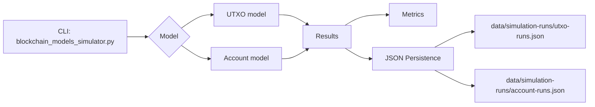
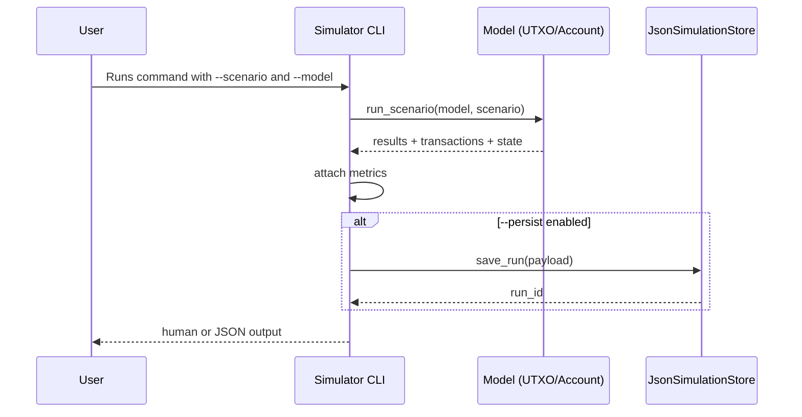

# MVP Technical Documentation

## 1. Goal

Model and compare two blockchain approaches:
- UTXO
- Account-based

with functional scenarios, traceability, compliance, and JSON persistence split by model.

## 2. Linear system diagram



## 3. Use cases

1. Run coffee-export simulation on both models.
2. Run retail-payments simulation on a selected model.
3. Persist simulation runs by model.
4. List persisted runs with limit and model filter.
5. Fetch run details by run_id.
6. Audit compliance (events/certificates) for traceable lots.

## 4. Main sequence diagram



## 5. Data structures

### 5.1 UTXO (unspent output state)

Main fields:
- utxo_id
- tx_id
- output_index
- amount
- owner
- created_at
- lot_id
- metadata

### 5.2 AccountState

Main fields:
- balance
- nonce
- created_at
- public_key

### 5.3 Persistence document

```json
{
  "schema_version": 1,
  "updated_at": "2026-03-21T00:00:00+00:00",
  "runs": [
    {
      "run_id": "run-20260321T000000Z-deadbeef",
      "created_at": "2026-03-21T00:00:00+00:00",
      "payload": {
        "model": "utxo",
        "scenario": "coffee-export",
        "requested_model": "both",
        "results": [
          {
            "model": "utxo",
            "scenario": "coffee-export",
            "metrics": {
              "execution_ms": 12.4,
              "total_events": 10,
              "total_transactions": 3,
              "pending_transactions": 0,
              "confirmed_transactions": 0,
              "finalized_transactions": 3,
              "chain_height": 2,
              "state_items": 4
            }
          }
        ]
      }
    }
  ]
}
```

## 6. Payloads and responses

Note: current MVP does not expose an HTTP API yet; payloads are CLI inputs and JSON outputs.

### 6.1 Request (CLI)

```bash
py scripts/blockchain_models_simulator.py --scenario coffee-export --model both --json --persist
```

### 6.2 Response (JSON)

```json
{
  "results": [
    {
      "model": "utxo",
      "scenario": "coffee-export",
      "events": ["..."],
      "balances": {"Exportador_Colombia": "69.75000000"},
      "validator_pool": "0.25000000",
      "chain_height": 2,
      "transactions": [],
      "utxos": [],
      "metrics": {
        "execution_ms": 10.1,
        "total_events": 11,
        "total_transactions": 3,
        "pending_transactions": 0,
        "confirmed_transactions": 0,
        "finalized_transactions": 3,
        "chain_height": 2,
        "state_items": 4
      }
    }
  ],
  "persisted_runs": [
    {
      "model": "utxo",
      "run_id": "run-20260321T000000Z-deadbeef",
      "store_file": ".../data/simulation-runs/utxo-runs.json"
    }
  ]
}
```

## 7. Execution conventions

- Model: `utxo`, `account`, `both`
- Scenario: `coffee-export`, `retail-payments`
- Persistence is split by file to avoid mixed model state.
- Regression tests: `py -m pytest -q`

## 8. Current MVP limitations

- No REST/GraphQL endpoints.
- No SQL/NoSQL database backend (JSON file-based persistence only).
- No end-user authentication/authorization layer.
