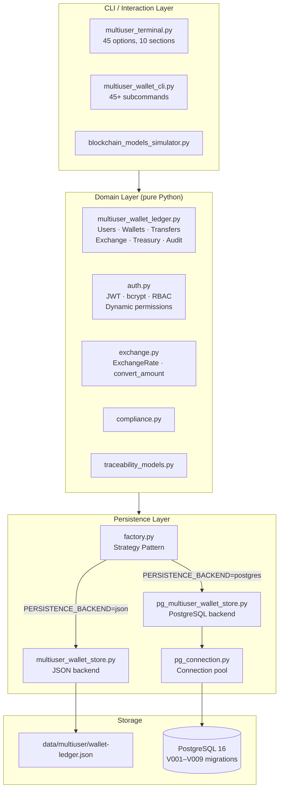
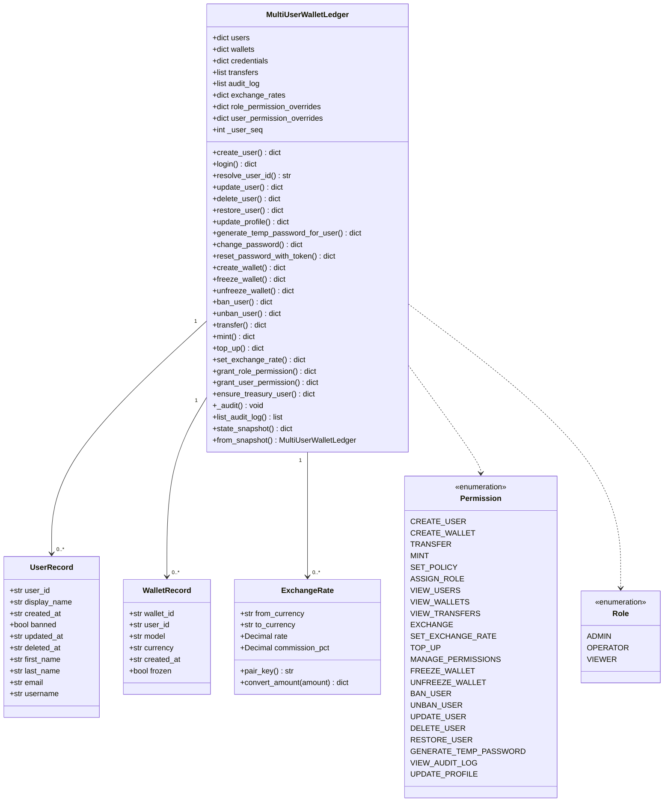
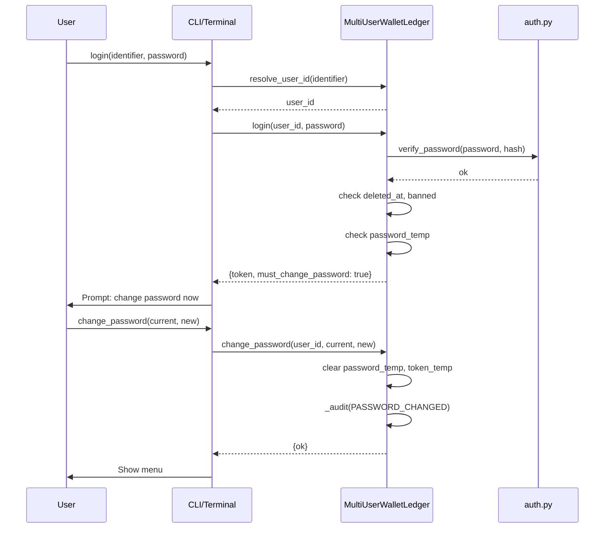
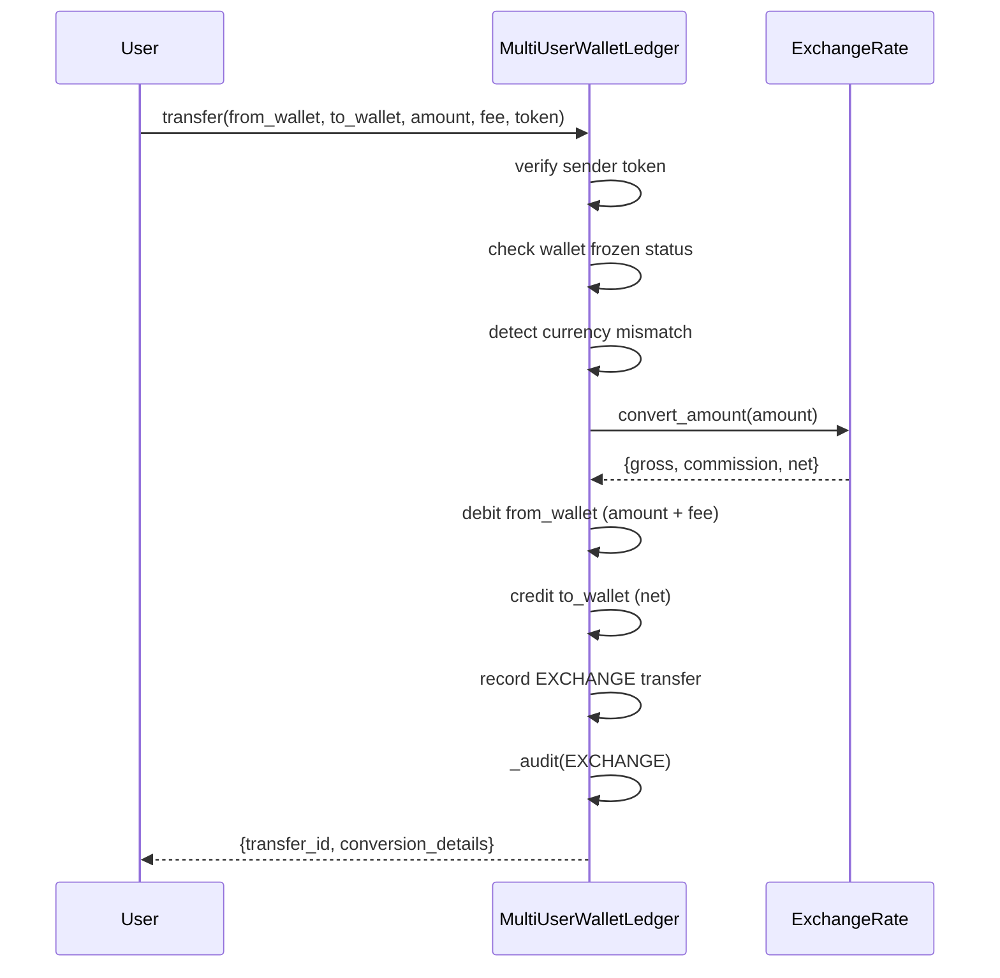
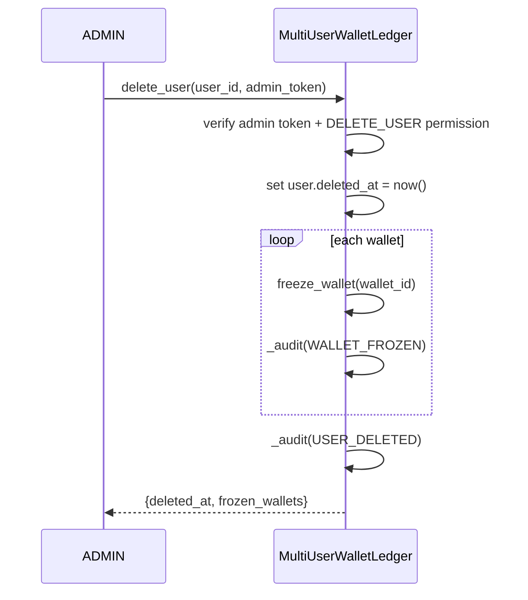

# System Technical Documentation — v2.8.0

## 1. Goal

Model and compare two blockchain approaches (UTXO and Account-based) with realistic functional scenarios, supply chain traceability, compliance, dual persistence (JSON / PostgreSQL), full multi-user wallet management, cross-currency exchange, corporate treasury, dynamic RBAC, and an append-only audit log.

---

## 2. Architecture diagram



---

## 3. Domain class diagram



---

## 4. Use cases

### User management
1. ADMIN creates a user — auto-generated `USR-XXXXX` ID, bcrypt-hashed password.
2. User logs in by `user_id` or `username`; receives JWT.
3. ADMIN generates a temporary password; user is forced to change on first login.
4. ADMIN soft-deletes a user (freezes all wallets, blocks login); can restore later.
5. ADMIN updates user ID or display name.
6. Any user updates their own profile (first_name, last_name, email, username).

### Wallet operations
7. User creates a UTXO or Account-based wallet.
8. ADMIN/OPERATOR mints tokens to a wallet.
9. User transfers funds between wallets (same or cross-currency with exchange conversion).
10. ADMIN tops up a wallet from the corporate treasury.
11. ADMIN freezes/unfreezes a wallet (blocks transfers).
12. ADMIN bans a user (auto-freezes all wallets).

### Exchange and treasury
13. ADMIN sets exchange rate with commission for a currency pair.
14. Transfer between wallets of different currencies applies the rate automatically.
15. ADMIN creates treasury wallets per currency; top-up debits treasury.

### RBAC and permissions
16. ADMIN grants/revokes permissions at role level (override hardcoded defaults).
17. ADMIN grants/revokes permissions at user level (highest priority).
18. Moderation operations require sudo JWT re-validation.

### Audit
19. Every significant action writes an entry to `audit_log` with actor, target, timestamp, details.
20. ADMIN lists audit log filtered by action type and/or user.

---

## 5. Main sequence diagrams

### Login with temporary password



### Cross-currency transfer



### Soft delete user



---

## 6. Data structures

### UserRecord (domain)

```python
@dataclass
class UserRecord:
    user_id: str          # Auto-generated USR-XXXXX
    display_name: str
    created_at: str       # ISO 8601
    banned: bool = False
    updated_at: str = ""
    deleted_at: str = ""  # Non-empty = soft deleted
    first_name: str = ""
    last_name: str = ""
    email: str = ""
    username: str = ""    # Unique, used for login
```

### Credentials (dict)

```python
{
    "hash": str,           # bcrypt hash
    "role": str,           # ADMIN | OPERATOR | VIEWER
    "password_temp": bool, # True = must change on next login
    "token_temp": str      # One-use token for password reset
}
```

### Audit log entry

```python
{
    "log_id": str,        # UUID
    "timestamp": str,     # ISO 8601
    "actor_id": str,      # user_id of who performed the action
    "action": str,        # USER_CREATED | LOGIN_SUCCESS | TRANSFER | ...
    "target_type": str,   # user | wallet | role | system
    "target_id": str,
    "details": dict       # Action-specific payload
}
```

### Audit actions reference

| Action | Trigger |
|--------|---------|
| USER_CREATED | create_user() |
| USER_UPDATED | update_user(), update_profile() |
| USER_DELETED | delete_user() |
| USER_RESTORED | restore_user() |
| USER_BANNED | ban_user() |
| USER_UNBANNED | unban_user() |
| WALLET_CREATED | create_wallet() |
| WALLET_FROZEN | freeze_wallet() |
| WALLET_UNFROZEN | unfreeze_wallet() |
| LOGIN_SUCCESS | login() success |
| LOGIN_FAILED | login() wrong password |
| LOGIN_BANNED | login() banned/deleted account |
| PASSWORD_CHANGED | change_password() |
| PASSWORD_TEMP_GENERATED | generate_temp_password_for_user() |
| ROLE_ASSIGNED | assign_role() |
| PERMISSION_GRANTED | grant_role/user_permission() |
| PERMISSION_REVOKED | revoke_role/user_permission() |
| TRANSFER | transfer() same currency |
| EXCHANGE | transfer() cross-currency |
| MINT | mint() |
| TOP_UP | top_up() |

### ExchangeRate

```python
@dataclass
class ExchangeRate:
    from_currency: str
    to_currency: str
    rate: Decimal
    commission_pct: Decimal  # e.g. Decimal("0.01") = 1%
```

### JSON snapshot structure

```json
{
  "schema_version": 3,
  "updated_at": "2026-03-22T00:00:00+00:00",
  "users": { "USR-00001": { "display_name": "Alice", "deleted_at": "", ... } },
  "credentials": { "USR-00001": { "hash": "...", "role": "ADMIN", "password_temp": false, "token_temp": "" } },
  "wallets": { "wallet_alice_01": { "user_id": "USR-00001", "model": "UTXO", "frozen": false, ... } },
  "transfers": [],
  "policies": {},
  "risk_profiles": {},
  "alerts": [],
  "exchange_rates": { "USD->EUR": { "rate": "0.92", "commission_pct": "0.01" } },
  "role_permission_overrides": { "OPERATOR": ["MINT"] },
  "user_permission_overrides": { "USR-00003": ["EXCHANGE"] },
  "audit_log": [],
  "user_seq": 3
}
```

---

## 7. PostgreSQL schema (V001–V009)

```mermaid
erDiagram
    users {
        varchar user_id PK
        varchar display_name
        timestamptz created_at
        boolean banned
        timestamptz updated_at
        timestamptz deleted_at
        varchar first_name
        varchar last_name
        varchar email
        varchar username UK
    }
    user_credentials {
        varchar user_id PK FK
        text password_hash
        varchar role
        boolean password_temp
        varchar token_temp
    }
    wallets {
        varchar wallet_id PK
        varchar user_id FK
        varchar model
        varchar currency
        timestamptz created_at
        boolean frozen
    }
    transfers {
        varchar transfer_id PK
        varchar from_wallet FK
        varchar to_wallet FK
        numeric amount
        numeric fee
        varchar transfer_type
        timestamptz created_at
        jsonb exchange_meta
    }
    exchange_rates {
        varchar pair_key PK
        varchar from_currency
        varchar to_currency
        numeric rate
        numeric commission_pct
    }
    role_permissions {
        varchar role PK
        varchar permission PK
    }
    user_permissions {
        varchar user_id PK FK
        varchar permission PK
    }
    audit_log {
        varchar log_id PK
        timestamptz timestamp
        varchar actor_id FK
        varchar action
        varchar target_type
        varchar target_id
        jsonb details
    }
    users ||--o{ user_credentials : "has"
    users ||--o{ wallets : "owns"
    wallets ||--o{ transfers : "from"
    wallets ||--o{ transfers : "to"
    users ||--o{ user_permissions : "has"
    users ||--o{ audit_log : "acts"
```

---

## 8. Permission resolution order

```
user_permission_overrides  (highest priority)
        ↓
role_permission_overrides
        ↓
ROLE_PERMISSIONS hardcoded defaults
```

---

## 9. CLI execution conventions

- `--json`: machine-readable JSON output.
- `--token JWT`: user-level JWT for authentication.
- `--sender-token WALLET_TOKEN`: wallet-level token for transfers (anti-replay).
- `--expected-nonce N`: prevents replay attacks on transfers.
- `user_id`: auto-generated as `USR-XXXXX` if omitted at creation.
- Login identifier: accepts `user_id` or `username`.

---

## 10. Current limitations

- No REST or GraphQL API (planned for v2.9.0+).
- No multi-tenancy or organization-level isolation.
- Audit log has no retention policy or archival mechanism.
- `token_temp` stored as plaintext in JSON snapshot; use PostgreSQL backend in production.
