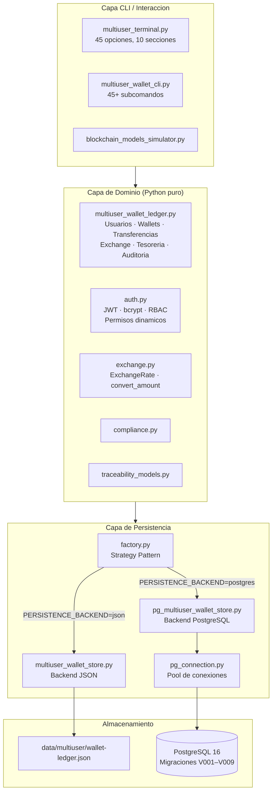
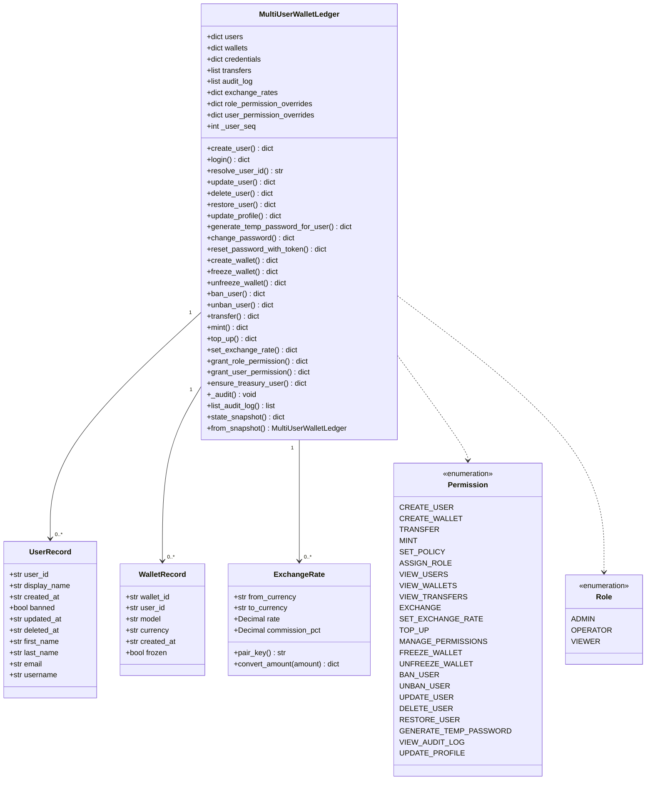
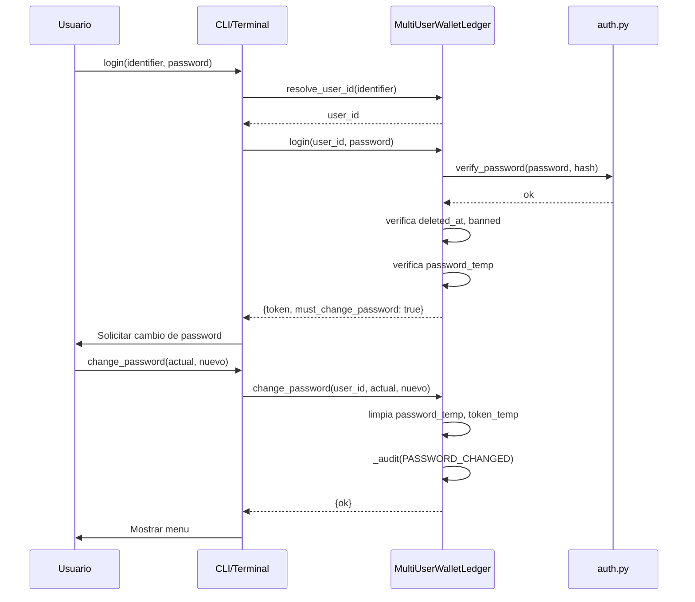
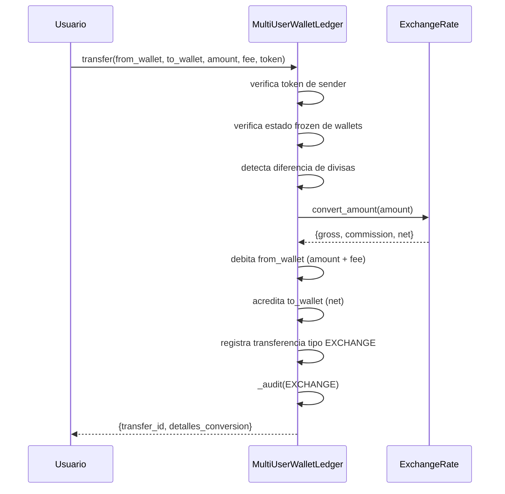
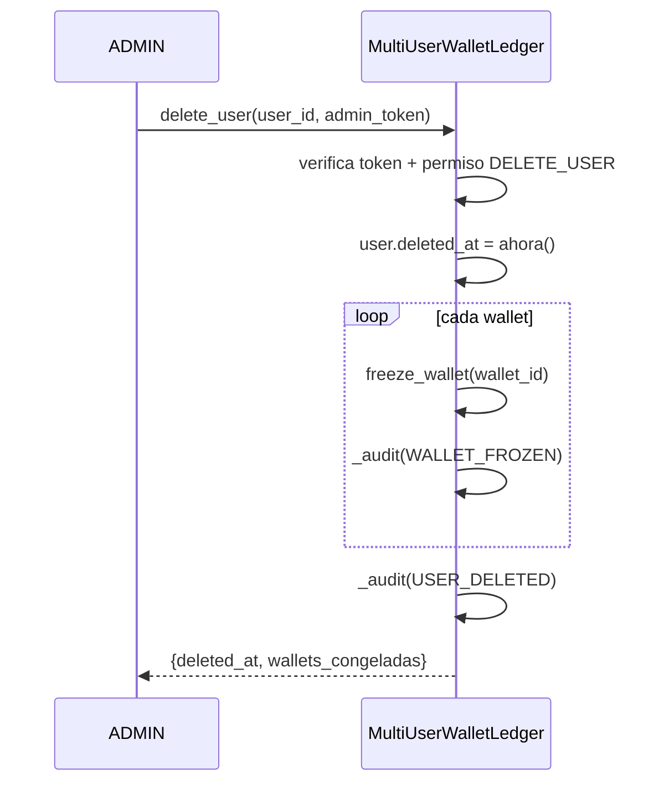

# Documentacion Tecnica del Sistema — v2.8.0

## 1. Objetivo

Modelar y comparar dos enfoques blockchain (UTXO y Account-based) con escenarios funcionales realistas, trazabilidad de cadena de suministro, compliance, persistencia dual (JSON / PostgreSQL), gestion multiusuario completa de wallets, intercambio de divisas, tesoreria corporativa, RBAC dinamico y log de auditoria append-only.

---

## 2. Diagrama de arquitectura



---

## 3. Diagrama de clases del dominio



---

## 4. Casos de uso

### Gestion de usuarios
1. ADMIN crea un usuario — ID auto-generado `USR-XXXXX`, password hasheado con bcrypt.
2. Usuario hace login con `user_id` o `username`; recibe JWT.
3. ADMIN genera password temporal; usuario debe cambiarlo en el primer login.
4. ADMIN elimina (soft delete) un usuario: congela wallets, bloquea login; puede restaurar.
5. ADMIN modifica ID o display_name de un usuario.
6. Cualquier usuario actualiza su propio perfil (first_name, last_name, email, username).

### Operaciones de wallets
7. Usuario crea wallet UTXO o Account-based.
8. ADMIN/OPERATOR hace mint de tokens a una wallet.
9. Usuario transfiere fondos entre wallets (misma o distinta divisa con conversion automatica).
10. ADMIN realiza top-up desde tesoreria corporativa.
11. ADMIN congela/descongela una wallet (bloquea transferencias).
12. ADMIN banea un usuario (congela todas sus wallets automaticamente).

### Exchange y tesoreria
13. ADMIN configura tasa de cambio con comision para un par de divisas.
14. Transferencia entre wallets de distinta divisa aplica la tasa automaticamente.
15. ADMIN crea wallets de tesoreria por divisa; top-up debita de tesoreria.

### RBAC y permisos
16. ADMIN otorga/revoca permisos a nivel de rol (override de defaults hardcoded).
17. ADMIN otorga/revoca permisos a nivel de usuario (maxima prioridad).
18. Operaciones de moderacion requieren re-validacion JWT (sudo, 3 intentos).

### Auditoria
19. Cada accion significativa escribe una entrada en `audit_log` con actor, objetivo, timestamp y detalles.
20. ADMIN consulta el audit log filtrado por tipo de accion y/o usuario.

---

## 5. Diagramas de secuencia principales

### Login con password temporal



### Transferencia cross-currency



### Eliminacion suave de usuario



---

## 6. Estructuras de datos

### UserRecord (dominio)

```python
@dataclass
class UserRecord:
    user_id: str          # Auto-generado USR-XXXXX
    display_name: str
    created_at: str       # ISO 8601
    banned: bool = False
    updated_at: str = ""
    deleted_at: str = ""  # No vacio = eliminacion suave
    first_name: str = ""
    last_name: str = ""
    email: str = ""
    username: str = ""    # Unico, se usa para login
```

### Credenciales (dict interno)

```python
{
    "hash": str,           # Hash bcrypt
    "role": str,           # ADMIN | OPERATOR | VIEWER
    "password_temp": bool, # True = debe cambiar en proximo login
    "token_temp": str      # Token de un solo uso para reset de password
}
```

### Entrada de audit log

```python
{
    "log_id": str,        # UUID
    "timestamp": str,     # ISO 8601
    "actor_id": str,      # user_id de quien ejecuto la accion
    "action": str,        # USER_CREATED | LOGIN_SUCCESS | TRANSFER | ...
    "target_type": str,   # user | wallet | role | system
    "target_id": str,
    "details": dict       # Payload especifico de la accion
}
```

### Acciones auditadas

| Accion | Disparador |
|--------|-----------|
| USER_CREATED | create_user() |
| USER_UPDATED | update_user(), update_profile() |
| USER_DELETED | delete_user() |
| USER_RESTORED | restore_user() |
| USER_BANNED | ban_user() |
| USER_UNBANNED | unban_user() |
| WALLET_CREATED | create_wallet() |
| WALLET_FROZEN | freeze_wallet() |
| WALLET_UNFROZEN | unfreeze_wallet() |
| LOGIN_SUCCESS | login() exitoso |
| LOGIN_FAILED | login() password incorrecto |
| LOGIN_BANNED | login() cuenta baneada/eliminada |
| PASSWORD_CHANGED | change_password() |
| PASSWORD_TEMP_GENERATED | generate_temp_password_for_user() |
| ROLE_ASSIGNED | assign_role() |
| PERMISSION_GRANTED | grant_role/user_permission() |
| PERMISSION_REVOKED | revoke_role/user_permission() |
| TRANSFER | transfer() misma divisa |
| EXCHANGE | transfer() divisas distintas |
| MINT | mint() |
| TOP_UP | top_up() |

### ExchangeRate

```python
@dataclass
class ExchangeRate:
    from_currency: str
    to_currency: str
    rate: Decimal
    commission_pct: Decimal  # ej. Decimal("0.01") = 1%
```

### Estructura del snapshot JSON

```json
{
  "schema_version": 3,
  "updated_at": "2026-03-22T00:00:00+00:00",
  "users": {
    "USR-00001": {
      "display_name": "Alice", "deleted_at": "", "first_name": "Alice",
      "last_name": "Smith", "email": "alice@example.com", "username": "alicesmith"
    }
  },
  "credentials": {
    "USR-00001": { "hash": "...", "role": "ADMIN", "password_temp": false, "token_temp": "" }
  },
  "wallets": {
    "wallet_alice_01": { "user_id": "USR-00001", "model": "UTXO", "frozen": false }
  },
  "transfers": [],
  "exchange_rates": { "USD->EUR": { "rate": "0.92", "commission_pct": "0.01" } },
  "role_permission_overrides": { "OPERATOR": ["MINT"] },
  "user_permission_overrides": { "USR-00003": ["EXCHANGE"] },
  "audit_log": [],
  "user_seq": 3
}
```

---

## 7. Esquema PostgreSQL (V001–V009)

```mermaid
erDiagram
    users {
        varchar user_id PK
        varchar display_name
        timestamptz created_at
        boolean banned
        timestamptz updated_at
        timestamptz deleted_at
        varchar first_name
        varchar last_name
        varchar email
        varchar username UK
    }
    user_credentials {
        varchar user_id PK FK
        text password_hash
        varchar role
        boolean password_temp
        varchar token_temp
    }
    wallets {
        varchar wallet_id PK
        varchar user_id FK
        varchar model
        varchar currency
        timestamptz created_at
        boolean frozen
    }
    transfers {
        varchar transfer_id PK
        varchar from_wallet FK
        varchar to_wallet FK
        numeric amount
        numeric fee
        varchar transfer_type
        timestamptz created_at
        jsonb exchange_meta
    }
    exchange_rates {
        varchar pair_key PK
        varchar from_currency
        varchar to_currency
        numeric rate
        numeric commission_pct
    }
    role_permissions {
        varchar role PK
        varchar permission PK
    }
    user_permissions {
        varchar user_id PK FK
        varchar permission PK
    }
    audit_log {
        varchar log_id PK
        timestamptz timestamp
        varchar actor_id FK
        varchar action
        varchar target_type
        varchar target_id
        jsonb details
    }
    users ||--o{ user_credentials : "tiene"
    users ||--o{ wallets : "posee"
    wallets ||--o{ transfers : "origen"
    wallets ||--o{ transfers : "destino"
    users ||--o{ user_permissions : "tiene"
    users ||--o{ audit_log : "actua"
```

---

## 8. Resolucion de permisos

```
user_permission_overrides  (maxima prioridad)
        |
role_permission_overrides
        |
ROLE_PERMISSIONS hardcoded defaults
```

---

## 9. Convenciones de ejecucion

- `--json`: salida JSON para integracion programatica.
- `--token JWT`: JWT de usuario para autenticacion.
- `--sender-token WALLET_TOKEN`: token de wallet para transferencias (anti-replay).
- `--expected-nonce N`: previene replay attacks en transferencias.
- `user_id`: se auto-genera como `USR-XXXXX` si se omite al crear.
- Identificador de login: acepta `user_id` o `username`.

---

## 10. Limitaciones actuales

- Sin API REST ni GraphQL (planificado para v2.9.0+).
- Sin multi-tenancy ni aislamiento por organizacion.
- El audit log no tiene politica de retencion ni archivado.
- `token_temp` se almacena en texto plano en el snapshot JSON; usar backend PostgreSQL en produccion.
